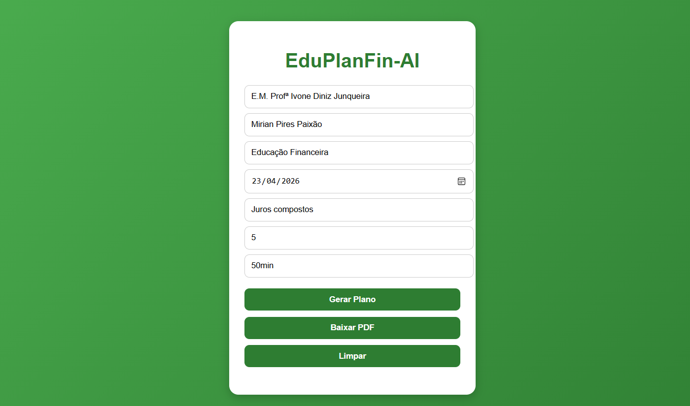
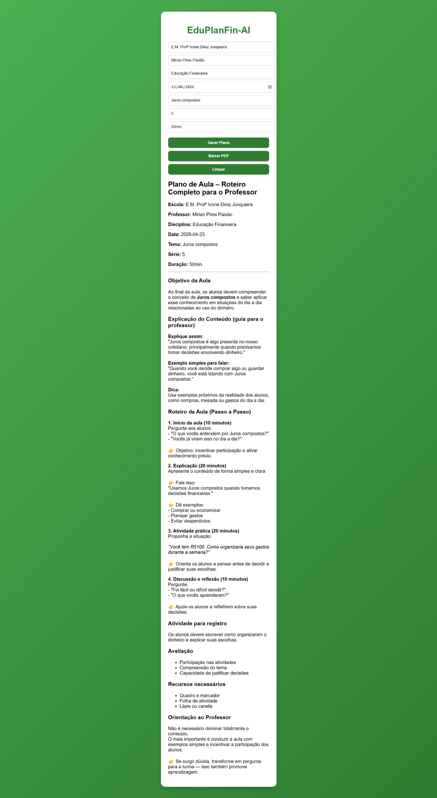

# 💰 EduPlanFin-AI

## 🌐 Acesse o sistema online

👉 https://alexjrpaixao.github.io/EduPlanFin-AI/

## 💻 Repositório no GitHub

👉 https://github.com/alexjrpaixao/EduPlanFin-AI

---

## 📌 Sobre o Projeto

O **EduPlanFin-AI** é um sistema desenvolvido com o objetivo de auxiliar no **planejamento financeiro pessoal**, utilizando conceitos de **Educação Financeira** aliados ao uso de **Inteligência Artificial**.

A proposta é oferecer uma ferramenta simples, acessível e educativa, que ajude usuários a tomar decisões financeiras mais conscientes, promovendo organização, controle de gastos e planejamento de metas.

---

## 🎯 Objetivo

Desenvolver uma solução digital voltada para:

* Estudantes
* Professores
* Usuários que desejam melhorar sua organização financeira

---

## 🚀 Funcionalidades

* 📊 Visualização de informações financeiras
* 💡 Apoio à tomada de decisão
* 🧠 Simulação de uso de Inteligência Artificial
* 📱 Interface simples e intuitiva

---

## 🛠️ Tecnologias Utilizadas

* HTML
* CSS
* JavaScript
* Conceitos de Inteligência Artificial

---

## 📸 Telas do Sistema

### 🖥️ Tela 1



### 🖥️ Tela 2



---

## 📂 Estrutura do Projeto

```
EduPlanFin-AI/
│
├── index.html
├── tela1.png
├── tela2.png
├── style.css
└── script.js
```

---

## ▶️ Como Executar Localmente

1. Baixe ou clone este repositório:

```
git clone https://github.com/alexjrpaixao/EduPlanFin-AI.git
```

2. Abra a pasta do projeto

3. Execute o arquivo `index.html` no navegador

---

## 📈 Melhorias Futuras

* Integração com APIs reais de Inteligência Artificial
* Criação de dashboard interativo
* Cadastro de usuários
* Armazenamento de dados financeiros
* Versão mobile

---

## 👨‍💻 Autores

**Alex Junior Paixão**
📚 Estudante de Administração e Tecnologia da Informação
💪 Profissional de Educação Física
**Ester Francine ZAmbate Fernandes**
**Henrique Oliveira Sampaio**
**Júlio Bonacim Silva**
**Leandro Carvalho Capucho**
**Thais de Souza Costa**
**Ulisses Henrique SAntos Silva**
**Victor Henrique da Silva**

---

## 📄 Licença

Este projeto é de uso acadêmico e pode ser utilizado para fins de estudo e aprimoramento.

---

## ⭐ Considerações Finais

O EduPlanFin-AI representa uma iniciativa de unir tecnologia e educação financeira, contribuindo para a formação de usuários mais conscientes e preparados para lidar com suas finanças no dia a dia.
